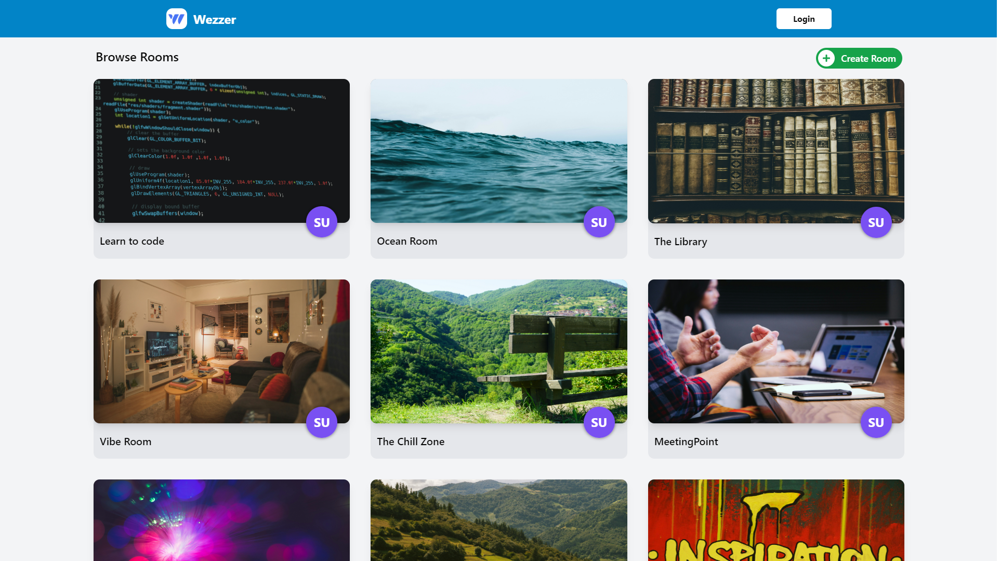
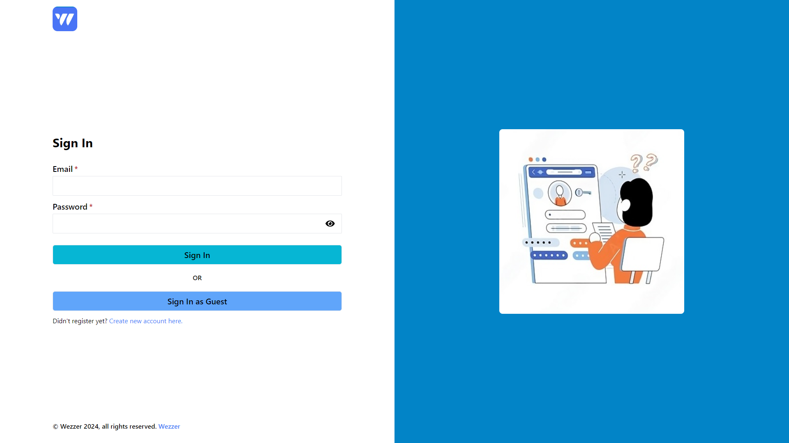
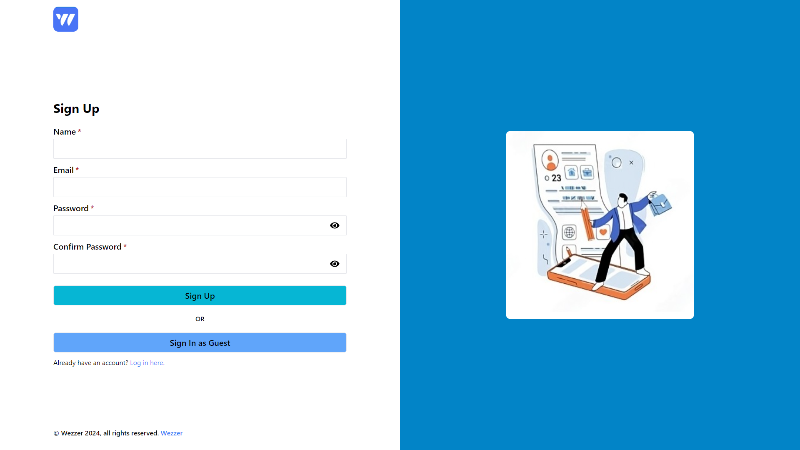
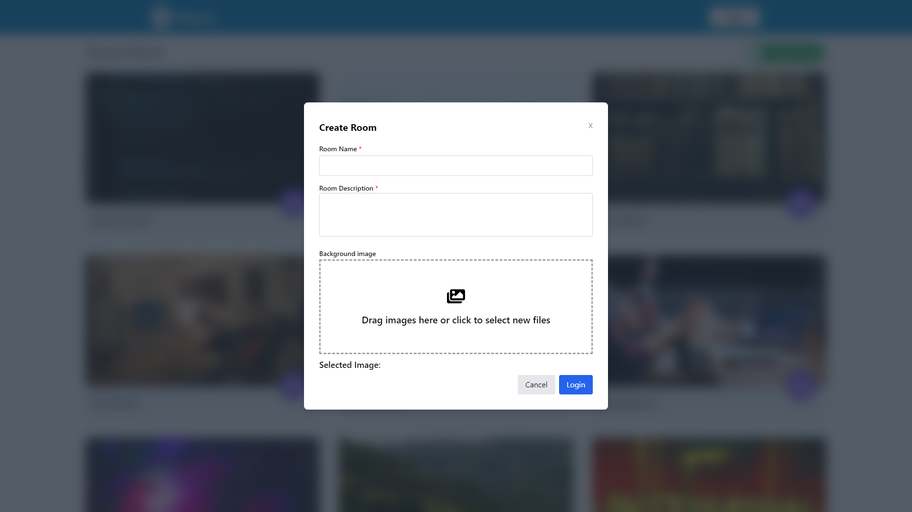
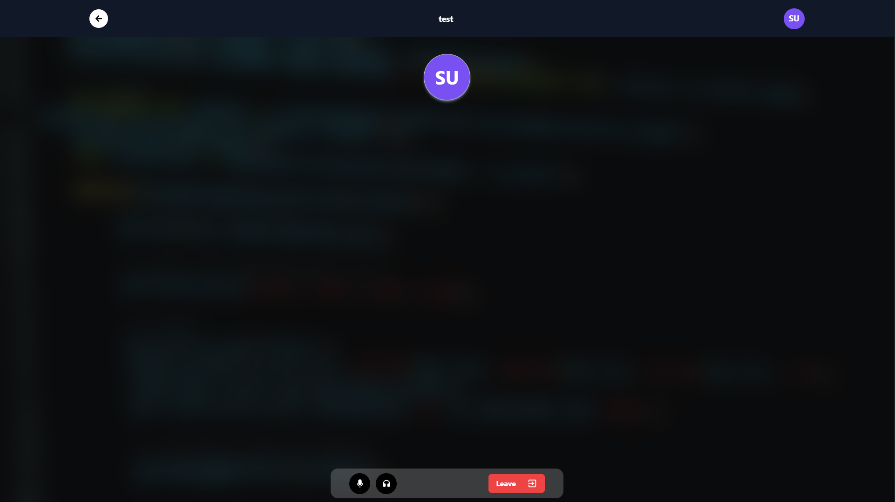

# Wezzer

This web application is a real-time group chat and discussion platform focused on voice communication. It allows users to connect effortlessly, enabling lively and engaging interactions in a shared virtual space. The platform is designed to provide a seamless user experience, with an intuitive interface styled using Tailwind CSS to ensure both functionality and accessibility. Whether for casual conversations, collaborative brainstorming, or in-depth discussions, this application creates an ideal environment for meaningful connections and dynamic exchanges, fostering a sense of community and collaboration among its users.

## Features 
 - UI created with Tailwind CSS and Framer Motion
 - Several Authentication Options
 - Self designed rooms
 - Multiple User conversations

## Live URL
https://wezzer-steel.vercel.app/

## Screenshots

### Home Page

### Login Page

### Sign Up Page

### Create Room Form

### Call Room

## Technologies

### Frontend

 - React JS
 - Typescript
 - Framer Motion + Tailwind CSS + Mantine UI
 - WebRTC

### Backend
 - Django
 - Web Sockets
 - Daphne

### Database
 - Supabase (PostgreSQL)

### Development Tools
 - Postman
 - VS Code
 - Prettier

## Contact
In case of any issues or for any other inquiries, please contact me at mateuszsuplice@gmail.com

